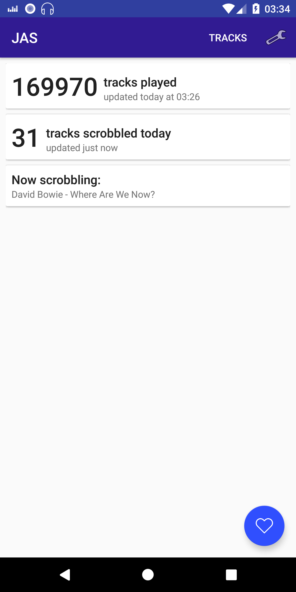
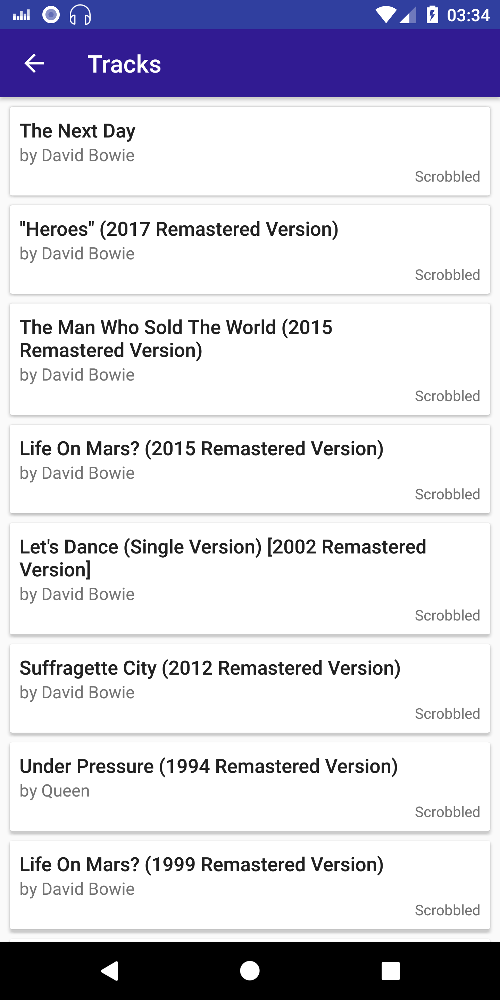
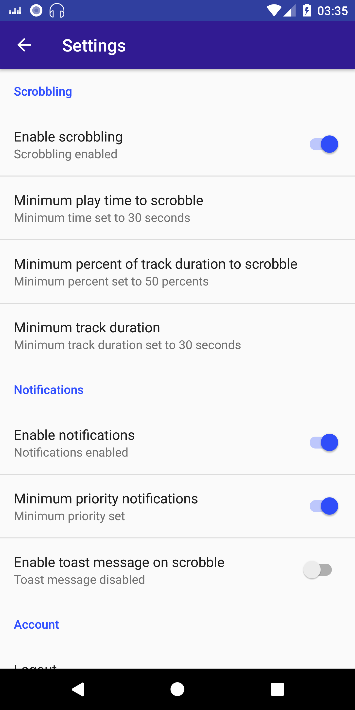

## JAS - Just Another Scrobbler (Beta)

JAS is a simple last.fm scrobbler. It displays simple scrobbling stat, scrobbled tracks and provide ability to love/unlove tracks.

Key features:
* Scrobbling to last.fm.
* Scrobbling even if you're offline. JAS will send your tracks to last.fm when you come back online.
* Updating Now playing status.
* Love/unlove
* Now playing notifications.

Supported players:
* Deezer
* Google Play Music
* Android Music Player
* more players coming soon!

Screenshots: 

&nbsp;
&nbsp;
